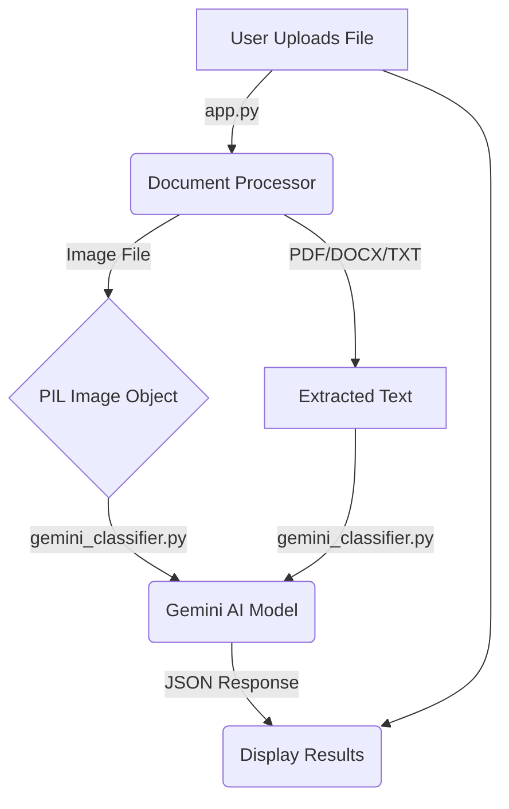

# Financial Document Classifier using Gemini AI

This project is a web-based application built with Streamlit that uses the Google Gemini AI model to classify financial documents. It can analyze various file formats, including PDFs, text files, Word documents, and images, and categorize them into types like invoices, receipts, bills, and more. The application leverages the multimodal capabilities of the Gemini 1.5 Flash model to analyze images directly without relying on traditional OCR.

---

## 🚀 Features

-   **Multi-Format Support**: Classifies a wide range of document types:
    -   PDF (`.pdf`)
    -   Images (`.png`, `.jpg`, `.jpeg`)
    -   Text Files (`.txt`)
    -   Microsoft Word Documents (`.docx`)
-   **Advanced AI Classification**: Uses the powerful `gemini-1.5-flash` model for fast and accurate classification.
-   **Multimodal Analysis**: Directly analyzes images, reading text and understanding layout for higher accuracy than OCR-based methods.
-   **Structured JSON Output**: The AI is prompted to return a clean JSON object containing the `category`, `confidence` score, and an `explanation`.
-   **Interactive Web UI**: A user-friendly interface built with Streamlit for easy file uploads and clear result visualization.
-   **Robust Error Handling**: Provides detailed error messages if the API key is invalid, content is blocked, or the AI response is malformed.

---

## 🔧 How It Works

The application follows a simple but powerful workflow:

1.  **File Upload (Streamlit)**: The user uploads a document through the web interface in `app.py`.
2.  **Document Processing (`document_processor.py`)**:
    -   If the file is an **image**, it is opened as a PIL Image object.
    -   If the file is a **PDF, DOCX, or TXT**, the text content is extracted.
3.  **AI Classification (`gemini_classifier.py`)**:
    -   The processed content (either the image object or the extracted text) is sent to the `GeminiClassifier`.
    -   A specialized prompt instructs the Gemini model to analyze the content and return its classification in a structured JSON format.
4.  **Display Results (Streamlit)**: The classification result is displayed in the web UI, showing the document type, confidence level, and the AI's reasoning.



---

## 🛠️ Setup and Installation

### Prerequisites

-   Python 3.8 or higher.
-   **Tesseract OCR Engine**: Required by `pytesseract` for the initial (now fallback) OCR logic. Even though we prioritize direct image analysis, it's good practice to have it installed. You can download it from [Tesseract at UB Mannheim](https://github.com/UB-Mannheim/tesseract/wiki).

### Installation Steps

1.  **Clone the Repository (or use your existing files)**
    If you were starting from scratch, you would clone the repository.
    ```bash
    git clone <repository-url>
    cd <repository-directory>
    ```

2.  **Create a Virtual Environment**
    It's highly recommended to use a virtual environment to manage dependencies.
    ```bash
    python -m venv venv
    source venv/bin/activate  # On Windows, use `venv\Scripts\activate`
    ```

3.  **Install Dependencies**
    Create a `requirements.txt` file with the following content and then run the installation command.

    **`requirements.txt`:**
    ```
    streamlit
    google-generativeai
    pydantic
    python-docx
    PyPDF2
    Pillow
    pytesseract
    ```

    **Installation Command:**
    ```bash
    pip install -r requirements.txt
    ```

4.  **Set Up Environment Variable**
    You must set your Google Gemini API key as an environment variable. This keeps your key secure and separate from the source code.

    **In Windows PowerShell:**
    ```powershell
    $env:GEMINI_API_KEY="your_api_key_here"
    ```

    **In macOS/Linux:**
    ```bash
    export GEMINI_API_KEY="your_api_key_here"
    ```

---

## ▶️ How to Run the Application

Once you have completed the setup, you can run the Streamlit application with a single command:

```bash
streamlit run app.py
```

Your default web browser will open a new tab with the application running.

---

## 📂 Project Structure

```
.
├── app.py                  # Main Streamlit application file (UI and orchestration)
├── document_processor.py   # Handles file reading and text/image extraction
├── gemini_classifier.py    # Interfaces with the Gemini AI for classification
├── requirements.txt        # Lists all Python package dependencies
└── README.md               # This documentation file
``` 